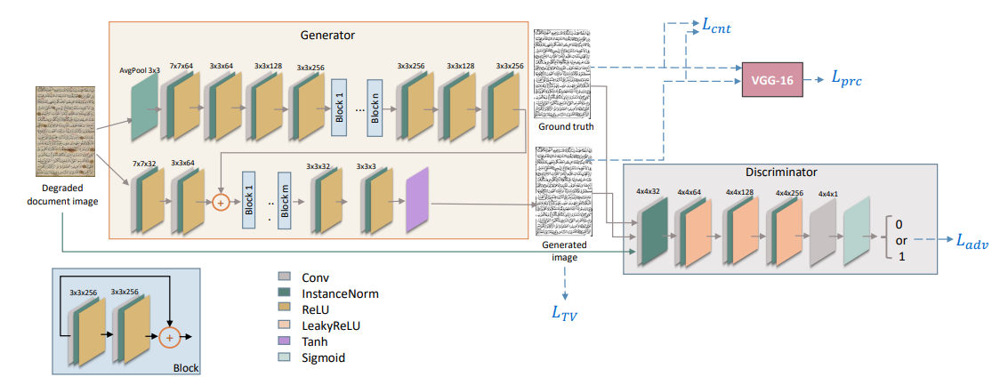

# EHDI: Enhancement of Historical Document Images via Generative Adversarial Network


## Prerequisites
- PyTorch implementation
- Linux or macOS
- Python 2 or 3
- NVIDIA GPU + CUDA cuDNN

## Getting Started
### Installation
- Install PyTorch and dependencies from http://pytorch.org
- Install python libraries [dominate](https://github.com/Knio/dominate).
```bash
pip install dominate
```

### Testing
- Test the model :
```bash
python test.py --dataroot datasets/ --name EHDI --phase test
```
The test results will be saved to here: `./results/`.

## Contact with me
If you have any questions, please contact with me.
